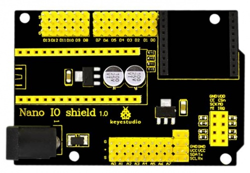
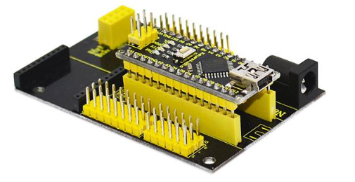
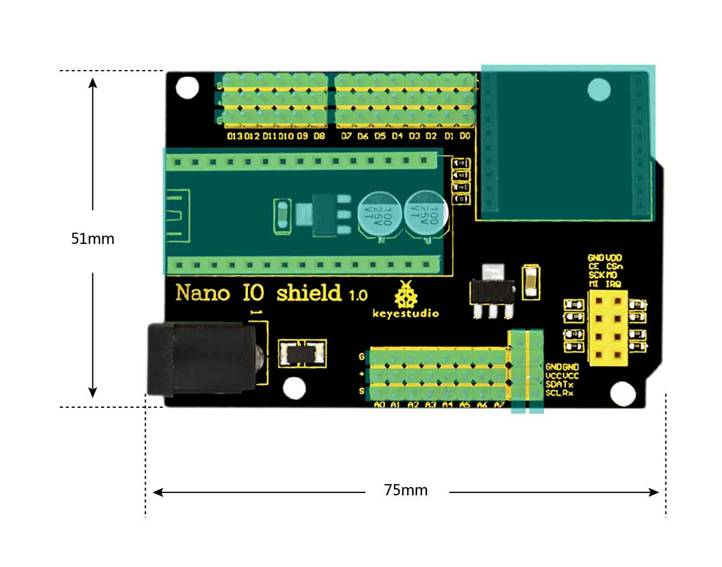
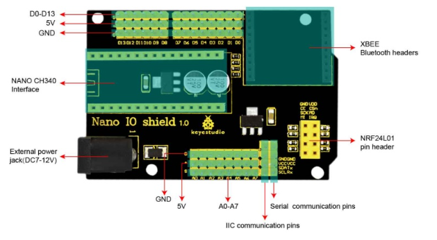
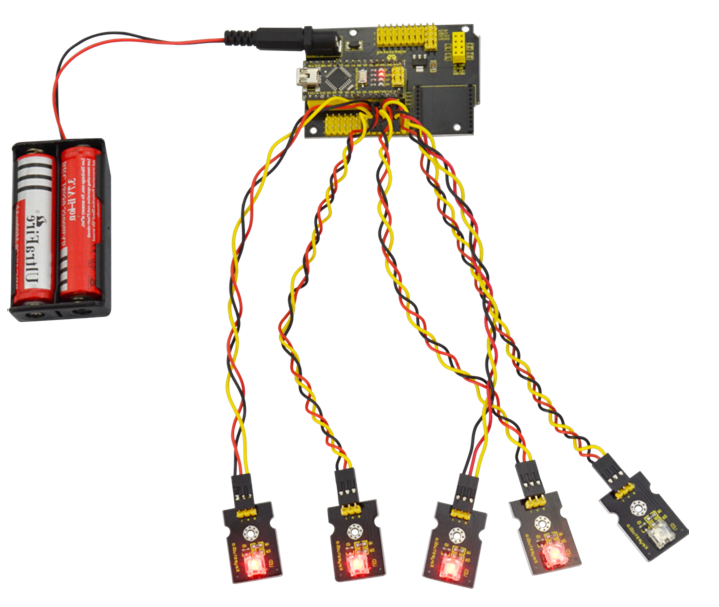

# KS0146 keyestudio Nano IO Shield

## 1. Introduction

keyestudio Nano ch340 is a small control board based on Arduino, very popular for everyone. But sometimes it is troublesome to connect a bunch of sensor modules and external power. So we particularly design this Nano IO shield.

This simple NANO IO shield extends all the digital and analog pins of Nano ch340 out into 3PIN (GND, 5V, signal), easy to hook it up to make experiments.

It also has some common communication pins like serial, I2C communication. On the shield comes with a Bluetooth Bee wireless header, a NRF24L01 wireless module header, and a black DC jack that can supply external power DC 7-12V to Nano ch340.

## 2. Features

- Extends 14 digital pins into 3PIN
- Extends 8 analog pins into 3PIN
- Comes with a Bluetooth Bee wireless module header
- Comes with a NRF24L01 wireless module header
- Comes with a serial communication pin
- Comes with an I2C communication pin
- Comes with a DC jack for external power (DC 7-12V)

## 3. Controller Compatible

- keyestudio Nano ch340

You can directly stack the NANO CH340 onto the shield

## 4. Technical Details

- Dimensions: 75mm x 51mm x 15mm
- Weight: 25g

## 5. PINOUT

## 6. Example Use

Stack the NANO CH340 onto the shield, and upload the code to the NANO CH340. then connect the LED module to the 3PIN interface D2-D6. Finally you should see the LED light up one by one, like flowing light.

